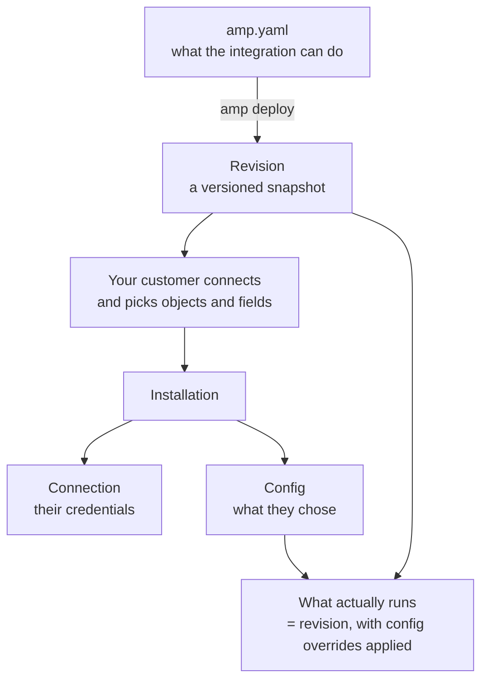

Ampersand has one core idea: **you define an integration once, and each of your customers gets their own installation of it.**

You describe what the integration can do in a manifest file. Each customer then connects their own account and chooses how much of that to enable. Ampersand stores those choices as a config and runs the integration against that customer's SaaS instance on their behalf.



## Integration

An **integration** defines how your application interacts with a third-party SaaS tool. You have a single integration for every customer connecting to that provider. For example, one integration called `mySalesforceIntegration`, where Salesforce is the **provider**.

You create an integration by defining it in a [manifest file](/manifest-reference) and deploying it with the [`amp` CLI](/cli/overview).

The manifest describes what is *possible*, not what any particular customer has turned on. It can say:

- objects and fields that are always read (`requiredFields`)
- fields the customer may choose from (`optionalFields`, or `optionalFieldsAuto: all`)
- fields the customer must map to their own schema (`mapToName`)
- a schedule, a destination, and backfill behavior

## Installation

An **installation** is one customer's instance of an integration. `mySalesforceIntegration` might have 30 installations, one per customer who has connected their Salesforce.

An installation is created when a customer connects through an [embeddable UI component](/embeddable-ui-components), or when you call the [Create installation](/reference/installation/create-a-new-installation) endpoint.

Each installation holds two things:

<CardGroup cols={2}>
  <Card title="Connection" icon="key">
    The credentials for that customer's SaaS instance. Ampersand supports OAuth, API keys, and basic auth, and handles token refresh for you.
  </Card>
  <Card title="Config" icon="sliders">
    That customer's choices, stored as overrides on the integration's definition: fields, mappings, schedule, and destination.
  </Card>
</CardGroup>

## Revision

Every time you change `amp.yaml` and run `amp deploy`, Ampersand stores a new **revision**, a versioned snapshot of the integration's definition.

Revisions matter because your customers are not all on the same version at the same moment. A config records the revision it was created or last updated against, so you can tell which definition a given customer is running.

<Note>
When Ampersand renders the field-mapping UI, it requests a **hydrated revision**: the revision enriched with live field metadata from that customer's connected instance. It carries the fields that actually exist in their account, with display names and types. That is how the UI can offer a customer *their* custom fields, not a generic list.
</Note>

## Config

The **config** records one customer's choices for an installation. It is not a complete description of what runs. It is a set of **overrides on top of the revision**.

<Note>
Anything the config specifies wins for that installation. Anything it leaves unset falls back to what the integration's revision defines. A config is a diff, not a replacement.
</Note>

This is why two customers on the same integration can behave differently without you maintaining two manifests, and why a customer who has changed nothing simply follows what you declared.

### What a config can override

For a read object, a config can set the fields the customer selected (`selectedFields`, or `selectedFieldsAuto: all`), the mappings they chose (`selectedFieldMappings`, `selectedValueMappings`), and operational settings: `schedule`, `destination`, `backfill`, `fieldFilters`, and `disabled` to pause an object entirely. For a write object it can set `deletionSettings`, `selectedFieldSettings`, and `selectedValueDefaults`.

### A worked example

Suppose your manifest declares:

```yaml
- objectName: contact
  destination: contactsWebhook
  schedule: "*/15 * * * *"
  requiredFields:
    - fieldName: email
    - mapToName: lifecycle_stage
  optionalFieldsAuto: all
```

A customer installs it and maps `lifecycle_stage` to their `hs_lead_status` field, adds two optional fields, and leaves everything else alone. Their config carries only those choices.

What actually runs for them is the merge: `email` and their two optional fields are read, `hs_lead_status` is mapped to `lifecycle_stage`, and the schedule and destination come from your revision, because the config never mentioned them.

If that customer later asks for hourly syncs, you set `schedule` on their config. It now overrides yours, for them alone. Every other installation still follows the manifest.

You can read a config with [Get an installation](/reference/installation/get-an-installation), or from the SDK via `installation.config`, and change one with [Update an installation](/reference/installation/update-an-installation).

## How they work together

<Steps>
  <Step title="You deploy an integration">
    `amp deploy` creates a revision from your `amp.yaml`. Nothing runs yet. You have only described what is possible.
  </Step>
  <Step title="A customer connects">
    They authenticate against their own SaaS instance through your embedded UI. Ampersand stores those credentials as a connection.
  </Step>
  <Step title="They choose what to share">
    Ampersand hydrates the revision with the live schema from their instance, and the UI offers the fields your manifest allows. Their selections become the config.
  </Step>
  <Step title="Ampersand runs it">
    Scheduled reads, writes, and subscriptions execute against that customer's instance, using your revision with their config's overrides applied, and deliver results to your destination.
  </Step>
</Steps>

### What this means in practice

- **One integration, many configs.** Two customers on the same integration can legitimately read different field sets. That is the design, not drift.
- **A config only carries what the customer changed.** Everything else follows your manifest, so defaults stay in one place.
- **To change one customer, update their config.** To change the default for everyone, change the manifest and deploy.
- **Mapped fields need a customer decision.** A `mapToName` entry cannot resolve until someone tells Ampersand which of their fields it corresponds to.

## Related terms

A **provider** is the third-party API you integrate with. A **provider app** is the OAuth app you register with that provider, stored in Ampersand so customers can authenticate against it. A **destination** is where read results are delivered: a webhook, warehouse, or queue.

For the full glossary, see [Terminology](/terminology).
